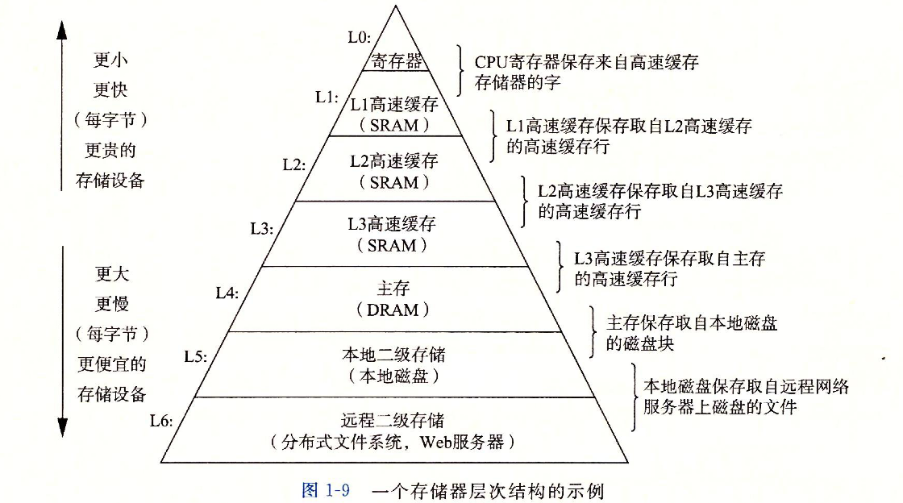
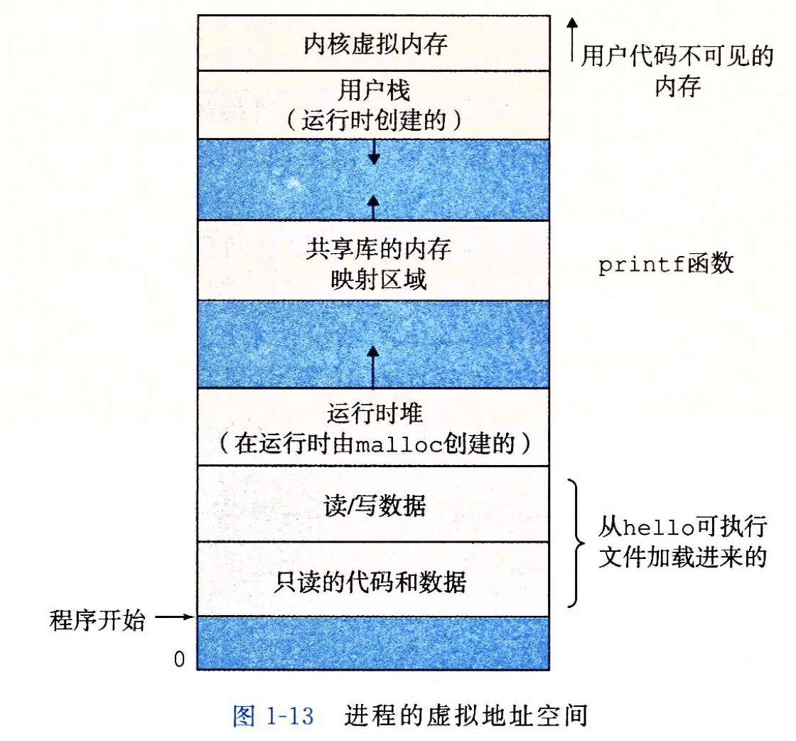

# 第一章

## C 语言的编译过程

通常，一段 C 语言代码的编译涉及到下面几个步骤

- **预处理阶段**：这个阶段需要处理 C 语言代码中的预处理命令，即以 `#` 开头的代码。编译器会把预处理指令使用到的头文件、`#define` 语句等替换成其他代码

- **编译阶段**：将 C 语言代码编译成汇编代码

- **汇编阶段**：将汇编代码编译成机器语言

- **链接阶段**：将一段代码的编译结果与其他代码的编译结果组合起来，生成一个可执行文件

## CPU 执行指令的操作

CPU 执行指令时，可能会用到下面这些操作

- **加载**：从主存中复制一个字节会一个字到寄存器中
- **存储**：从寄存器中复制一个字节或一个字到主存中
- **操作**：将两个寄存器的值复制到 ALU 中，ALU 对这两个字做运算，并把结果放到一个寄存器中
- **跳转**：从指令本身中抽取一个字，把这个字复制到程序计数器 PC 中

## 存储设备的层次结构

## 操作系统的作用

操作系统有两个基本的功能

1. 防止硬件被失控的应用程序滥用
2. 向应用程序提供简单一致的机制，来控制复杂又各不相同的低级硬件

**进程** 是系统中正在运行的程序的一个抽象，操作系统中可以同时运行多个进程，但每个进程都好像在独占的使用硬件。操作系统需要跟踪进程的所有状态，这些状态被称为 **上下文**，包括 PC 寄存器的值、主存的内容等。当操作系统需要把运行权给另一个进程时，就会发生上下文切换，即保存当前进程的上下文，加载下一个进程的上下文

**虚拟内存** 是对主存的抽象，让每个进程以为自己独占了整个主存。每个主存看到的内存都是一致的，这成为 **虚拟地址空间**。

上图数一个进程的虚拟地址空间，它共有下面几个部分

- **程序代码和数据**：这一段包含了程序运行的所有代码和全局变量
- **堆**：在 C 语言中，可以使用 `malloc` 和 `free` 函数，动态的在堆中申请内存
- **共享库**：这一段内存空间存放着向 C 标准库、数学库等公共的代码
- **栈**：栈空间用来实现方法的调用，每一个方法的调用发生时，栈就会增长；当方法返回时，栈就会收缩
- **内核虚拟内存**：这个区域是为内核保留的，应用程序并不被允许读取这个区域或直接调用内核代码定义的函数

每个 IO 设备，包括键盘、磁盘、显示器，都可以看成是 **文件** ，因为它们都可以产生字节序列

## 提升性能

如何提升性能有多种多样的方法，可以分为下面几种

- **使用多核处理器**：在一个 CPU 中封装了多个内核，这样就能同时运行多个进程了
- **超线程**
- **SIMD**：让一个指令可以并发执行的操作，例如最新的 Intel 和 AMD 处理器可以并发执行 8 对 float 型数据的假发
- **流水线**

超线程和流水线技术特别的相似，一句话也说不明白，大致都是说一个指令的执行可以分为多个步骤，每个步骤由不同的硬件负责，当一个硬件正在执行时，其他硬件就闲了下来，这时可以让这些硬件去干其他事，从而提高性能