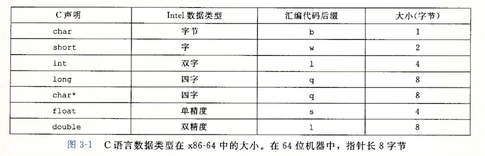
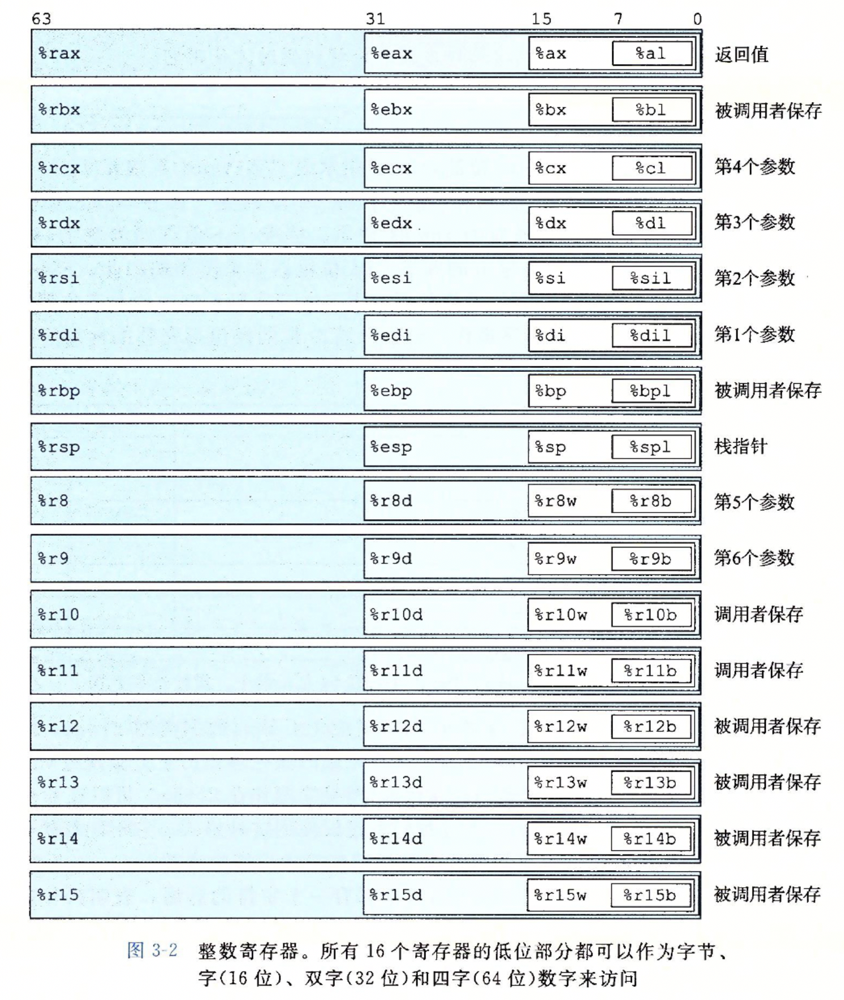
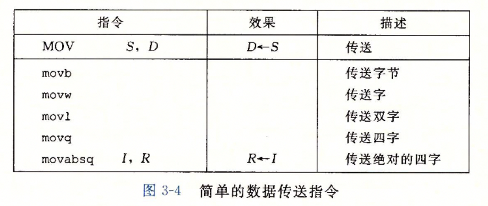
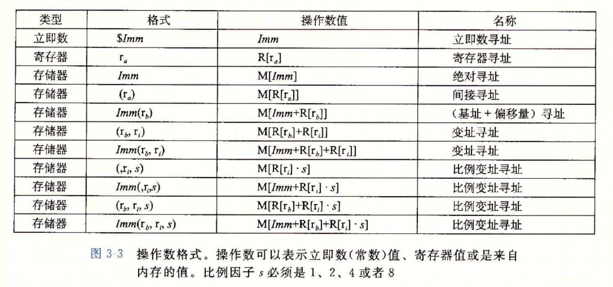
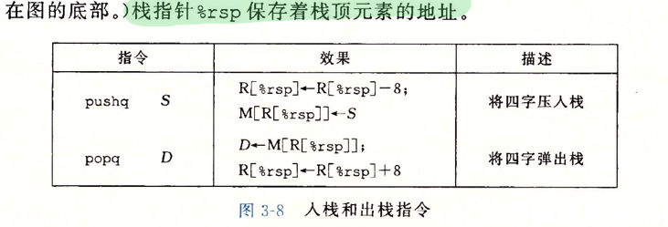
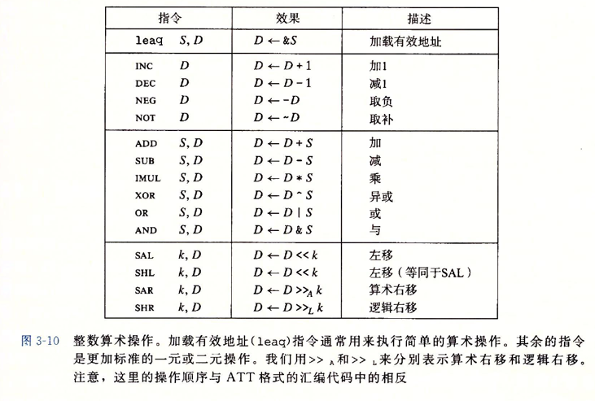
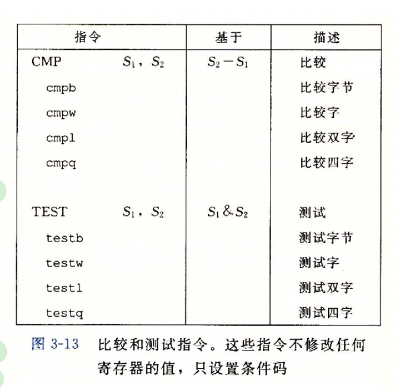
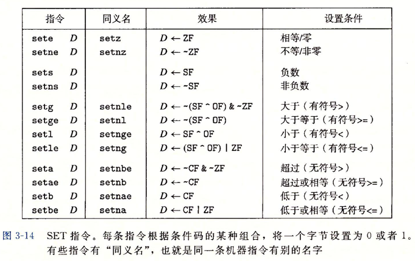
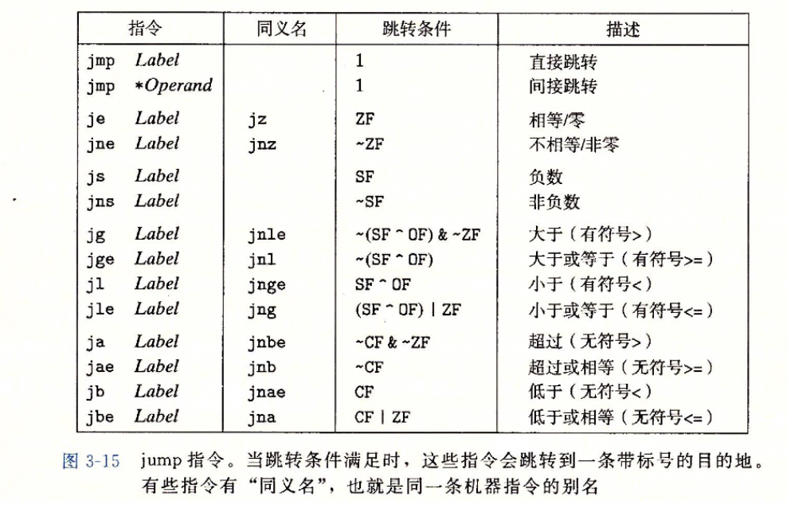
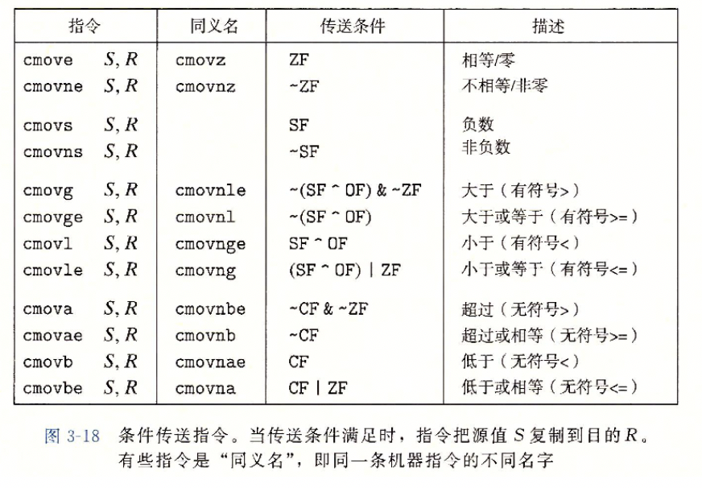

# 第三章

## 重要的寄存器

在 x86-64 计算机中，有下面这些重要的寄存器

- 程序计数器（PC）：保存下一条需要执行的指令的内存地址
- 整数寄存器：共有 16 个，保存函数调用参数、临时变量、函数返回值等
- 条件码寄存器：保存算数或者逻辑指令的状态信息，以实现 if 和 while 等逻辑
- 向量寄存器：保存整数或者浮点数值

Intel 使用 word 来表示 16 位的数据，因此 32 位的数据就是双字 double word，64 位的数据就是四字 quad word。下图是在 64 位系统中，C 语言中的各种数据类型的字长和汇编代码后缀



下图 16 个整数寄存器




## 生成汇编代码

通过 C 语言文件生成汇编代码，可以使用 gcc 的 -S 选项就能生成汇编代码，如下

```shell
gcc -0g -S main.c
```

-0g 选项是为了不让 gcc 去优化代码，因为普通人很难看懂被优化后的汇编语言逻辑，即使功能是完全一样的

而如果通过机器语言生成汇编代码，可以使用反汇编器的 -d 选项，如下

```shell
objdump -d main.o
```


## 汇编指令

### MOV 类指令

下图是各种 MOV 指令



指令的第一个操作数是源地址，第二个操作数是目的地址。源地址和目的地址可以是寄存器，也可以是内存地址，它们的寻址方式如下图所示



### push 和 pop 类指令

push 和 pop 类指令用来支持 C 语言中函数调用的入栈和出战的过程，指令如下



其实使用 mov 类指令以及 rsp 寄存器，我们自己可以实现这两个命令

### 算数运算

算数运算指令如下



多数指令的第一个操作数是源，第二个指令是目的。使用 leap 指令和上面的寻址方式，可以很方便的把需要两三条指令才能完成的操作变成只需要一条指令就能完成

### 移位指令

移位操作需要两个参数，第一个移位的量，第二个参数是被移位的寄存器或内存地址

左移位指令有两个：分别是 SAL 和 SHL，这两个指令功能是一样的。

右移位指令也有两个：分别是 SAR 和 SHR，前者执行算数右移（填上符号位），后者执行逻辑右移（填上 0）

### 64 位数相乘

当两个 64 位有符号或者无符号数相乘时，结果必须要保存在 128 位寄存器中。但是在目前的 x86-64 平台上，并没有 128 位寄存器，因此要保存这样的结果，需要有两个 64 位寄存器。


上图的 imulq 和 mulq 指令能实现 64 位数相乘，操作只有一个，即一个保存着 64 位数的寄存器或者内存地址，另一个操作数保存在 rax 寄存器中。两数相乘后的结果的高 64 位保存在 rdx 寄存器中，低 64 位保存在 rax 中

上图的 idivq 和 divq 指令实现了 128 位被除数与 64 位数相除。与乘法一样，128 位数的高 64 位和低 64 位分别保存在 rdx 和 rax 中，相除后的商保存在 rax 中，余数保存在 rdx 中（上图好像有错误）

clto 是用来做符号位扩展的。在除法中，被除数通常也是一个 64 位数，这时我们把被除数放在 rax 寄存器中，然后执行 clto 指令，这条指令会读出 rax 的符号位的数值，然后复制到 rdx 的所有位中，这样就把一个 64 位数扩展到了 128 位

### 条件控制

除了这些整数寄存器外，CPU 中还有一些条件码寄存器

- CF：进位标志。最近的操作使最高位产生了进位。可以用来检查无符号操作的溢出
- ZF：零标志。最近的操作得出的结果是零
- SF：符号标志。最近的操作得到的结果是负数
- OF：溢出标志。最近的操作导致一个补码溢出：正溢出或者负溢出

我们假设最近的操作使 `t = a + b`，这些标志位的值对应的情况如下

- CF：`(unsigned) t < (unsigned) a`
- ZF：`t == 0`
- SF：`t < 0`
- OF：`(a < 0 == b < 0) && (t < 0 != a < 0)`

需要注意的是，有时候算数操作会有 leap 指令来简化，但是 leap 指令是地址操作，不会设置条件码寄存器的值

要设置条件码寄存器，除了使用算数运算指令外，可以使用下面两种比较和测试指令



cmp 指令的效果与sub 指令的效果一致，唯一的区别是 cmp 指令不会修改目的寄存器的值。同理，test 指令与 and 指令的效果一致，汇编代码 `testq %rax, %rax` 可以用来检测 rax 寄存器内的值是负数、0 或者正数

我们通常不会直接读取条件码寄存器的值，而是利用三种方式使用它们的值

#### SET 指令

SET 指令如下



#### 条件跳转

跳转指令根据条件寄存器的值，跳转到汇编代码中不同的地方

跳转分为直接跳转和间接跳转。直接跳转会跳到一个指定的 Label，而间接跳转回跳到寄存器或内存地址中指定的代码地址

跳转指令还有两种编码：相对编码和绝对编码。相对编码中，跳转指令后的值是目的地址的偏移量，偏移量的值有一个、两个或者四个字节；而绝对编码中，跳转指令后的值是绝对的物理地址，使用四个字节指定

使用相对跳转地址编码时，跳转的目的地是偏移量加上跳转指令的下一条指令的地址作为目的地址。因为在 CPU的实现中，更新 PC 寄存器的值是指令执行的第一步



#### 条件传送

使用跳转指令的一个弊端是，它不够高效。因为当前的 CPU 都使用了流水线技术，这样在执行一条指令的时候，CPU 会预先取出下一条指令，而如果使用了跳转指令，那么下一条指令的地址实际上是取决于当前指令的执行结果了。所以说 CPU 预先取出的指令可能是错的，如果错误真实发生了，那么 CPU 需要丢掉这条指令，取出正确的指令。

而条件传送指令就是为了避免这样的情况。当有 if-else 代码时，如果想要使用条件传送指令，就要计算 if 和 else 的代码块，if 代码块的执行结果保存在 rax 寄存器中，然后根据 if 判断条件的结果，使用条件传送把 else 的结果传送到 rax 中



使用条件传送可以避免取出错误指令，但是它也可能引入一些问题

1. 条件传送要求 if 和 else 代码块没有副作用
2. 如果执行 if 或者 else 代码块的效率很低，那么使用条件传送并不见得比使用条件跳转更高效