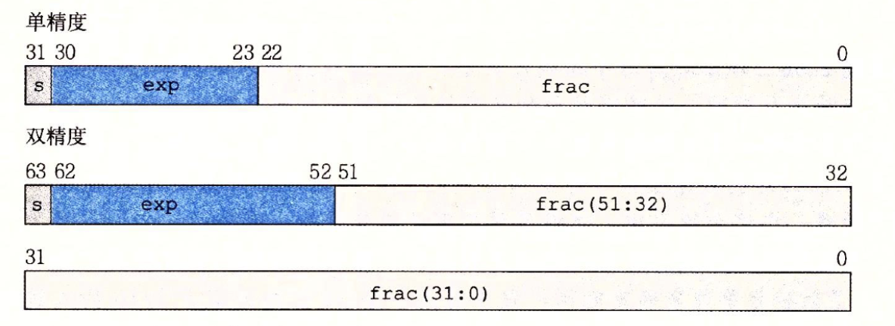
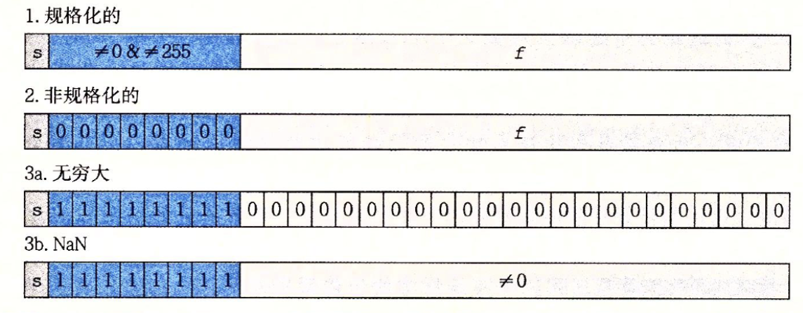

# 第二章

第二章中，最重要的部分就应该是 IEEE 浮点数了

IEEE 使用下面的公式来表示一个数

$V = (-1)^s * M * 2^E$

- 符号 s（sign），表示数的正负
- 尾数 M（significand），要么满足 $1 \le M < 2$，要么满足 $0 \le M < 1$ 。M 的取值范围究竟是哪种，下面会说
- 阶码 E（exponent）

单精度浮点数是 32 位，双精度浮点数是 64 位。

编码 s 需要 1 位，我们设编码 E 需要 k 位，编码 M 需要 n 位。对于单精度浮点数，k = 8，n = 23；对于双精度浮点数，k = 11，n = 52

在实际编码中，s 处于最高位，接下来是 k 为的阶码，剩下的都是 n 位的尾数（这可能也是尾数名字的由来）

对于尾数 M 的取指范围，有下面 3 种情况

1. 规格化的

规格化的值，即阶码既不是全 0 也不是全 1，此时阶码 E 的实际值是 $(e_{k-1}...e_1e_0)_2 - (2^{k-1} - 1)$ 。因此阶码 E 的取指范围，对于单精度是 -126 至 127，双精度 -1022 至 1023 之间

尾数 M 的实际值是 $1.f_{n-1}...f_1f_0$，

2. 非规格化的

当阶码全是 0 时，浮点数就是非规格化的。此时阶码 E 的实际值是 $1 - (2^{k-1} - 1)$ 。对于单精度是 -126，对于双精度是 -1022

尾数 M 的实际值是 $0.f_{n-1}..f_1f_0$

非规格化浮点数让我们能表示 0 了，只要尾数全是 0 即可。当符号位是 0 时，我们就有 +0.0；当符号位是 1 时，我们就有 -0.0 。有些时候，+0.0 和 -0.0 被认为是不相同的

3. 特殊值

当阶码全为 1 时浮点数可以表示一些特殊值。

当尾数全为 0 时浮点数可以表示无穷。符号位是 0 时我们得到正无穷；符号位是 1 时我们得到负无穷

当尾数不全为 0 时，浮点数表示 NaN，即 Not a Number

---

对于单精度浮点数，最小的规格化正数是 $2^{-126}$，最大的非规格化正数是 $2^{-126} * (0.1...1)_2$ （共有 23 个 1）。因此两者是非常接近的，这就是非规格化数和规格化数之间的平滑过渡