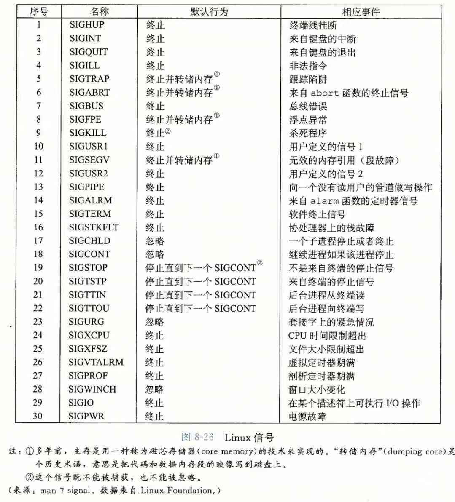

# 第八章

所谓的控制流，是指由一系列指令组成的流程，CPU 会按照顺序执行这些指令。 

在最简单的情况下，CPU 依次执行指令。但是在发生了诸如跳转、调用和返回时，CPU 会被打断执行顺序，转而去执行其他指令。我们把这种不按照顺序执行命令叫做**异常控制流**。除了程序主动产生异常控制流外，系统、硬件也会产生异常控制流，如硬件定时器定期产生信号 

**异常**是异常控制流的一种形式，它一部分由硬件实现，一部分由操作系统实现。当一个异常发生后，CPU 会通过一张叫做**异常表（exception table）**的跳转表，执行一个间接过程调用，到一个专门处理这种异常的**异常处理程序（exception handler）**中。当异常处理完成后，会发生下面 3 种情况之一 

1. 处理程序将控制返回给当前指令，即当异常发生时正在执行的指令（相当于指令被重新执行一次） 
2. 处理程序将控制返回给如果没有发生异常时会执行的下一条指令（相当于异常没有发生一样） 
3. 处理程序终止被中断的程序 

系统给每个可能发生的异常分配了一个唯一的非负整数，叫做**异常号（exception number）**。CPU 通过异常号，从异常表中找到异常处理程序的地址。异常表的起始地址保存在一个叫做**异常表基址寄存器（exception table base register）**的特殊 CPU 寄存器中。异常处理程序运行在内核模式下 

异常可以分为 4 种类型 

1. 中断（interrupt） 
2. 陷阱（trap） 
3. 故障（fault） 
4. 终止（abort） 

**中断**

中断是来自处理器外部的 IO 设备的信号的结果。中断发生后，中断处理程序会开始运行，结束后会把控制返回给下一条指令，就像中断没有发生过一样。 

中断不是由任何一条指令造成的，从这个意义上来说它是异步的。剩下 3 种类型的异常都是同步的，因为它们是指令执行造成的，这类指令叫做故障指令（faulting instruction） 

**陷阱**

陷阱是有意的异常，是执行一条指令的结果。陷阱处理程序把控制返回给产生陷阱的指令的下一条指令。它最重要的作用是在用户程序和内核之间，提供像过程调用一样的接口，叫做系统调用 

**故障**

故障是由错误情况引起的，但是可以被故障处理程序正确修正。它是无意发生，陷阱是有意发生的。故障处理程序修复故障后，将控制返回给当前指令。 

一个典型的故障是缺页异常，当指令引用了一个虚拟地址，但是虚拟地址对应的物理地址不在内存中时，就会发生缺页异常，故障处理程序会从硬盘中取出相应的数据然后放入内存中 

**终止**

终止是不可恢复的致命错误，通常是一些硬件错误，如 DRAM 或者 SRAM 位被破坏后发生的奇偶错误。终止发生后，进程会被杀死 

**Linux/x86-64 系统中的异常**

在 x86-64 中由 256 种异常类型，0~31 的异常号由 Intel 架构师定义，32~255 异常号是操作系统定义的中断和陷阱。下面是一些常见的异常 

- 除法异常（异常号 0）。当以 0 为除数，或者除法的结果对于目标操作数太大了的时候就会发生除法异常，之后程序会终止 
- 一般保护异常（异常号 13）。当程序引用了一个未定义的虚拟内存地址，或者尝试写一个只读的内存区域，就会发生一般保护异常，也叫段异常（Segementation Fault）。段异常发生后程序会终止 
- 缺页异常（异常号 14） 
- 机器检查（异常号 18）。发生应用错误时产生，程序终止 

Linux 有上百种系统调用，让应用程序能请求内核服务，包括都文件、写文件、创建进程等，每个系统调用也都有一个唯一的整数号，对应到一个内核跳转表的偏移量（这个跳转表不是异常表） 

**进程**

进程为应用程序提供了一种虚拟的假象，好像应用程序能使用所有的地址空间。每个进程只能访问自己的地址空间。地址空间中有应用程序的代码、数据、堆和栈。代码段总是从地址 0x400000 开始。地址空间的顶部留给操作系统内核使用的，当进程运行在内核模式下，这部分内存用于保存内核栈等信息 

进程拥有两种模式，一种是内核模式，在这个模式下，进程可以执行所有的指令；另一种模式是用户模式，在这个模式下的进程不能执行特权指令。进程所处于的模式由某个寄存器中的某个模式位（mode bit）来控制。 

操作系统会为每个进程维护一个上下文（context），上下文中包含了进程运行需要的各种信息，如各种寄存器、用户栈、状态寄存器、内核栈等数据结构。当处理器使用调度器把进程的运行权限交给另一个进程之前，它会把当前进程的上下文保存下来，然后把将被启用的进程的上下文调入，然后进程就可以开始运行了。这就给进程一个假象，仿佛它没有被调度器暂停执行过 

从程序员的角度来说，进程总是处于下面 3 个状态之一 

- 运行：进程要么在 CPU 上执行，要么在等待被执行且最终会被内核调度 
- 停止：进程的执行被挂起，且最终不会被调度。进程收到 SIGSTOP、SIGTSTP、SIGTTIN、SIGTTOUT 信号时，就会进入这个状态，知道收到一个 SIGCONT 信号，它又会进入运行状态 
- 终止：进程永远的停止了。它进入这个状态有 3 个原因：1）收到一个信号，这个信号的默认行为是终止程序；2）从主程序返回；3）调用 exit 函数 

C 语言中的 fork 函数可以创建一个进程，子进程与父进程几乎一样，子进程有与父进程相同的虚拟地址空间的副本（注意这里副本的意思，它表明子进程的虚拟地址空间的内容与父进程一致，但是两者的虚拟地址空间是独立的，即子进程对自己的地址空间的修改不会影响父进程的地址空间），相同的任何打开的文件描述符。他们之间最大的不同是两者的 pid 。注意到这一点后，也就理解了 C 语言中调用 fork 函数前后的奇怪代码 

进程在进入终止状态后，操作系统并不立即把进程清除，进程需要等待自己的父进程来回收，父进程回收它后子进程才最终从系统中被删去。一个已经终止但是没有被回收的进程叫做僵尸进程（zombie process） 

如果父进程终止了，那么子进程的回收会交给 init 进程来处理。init 进程的 pid 是 1，是 Linux 系统在启动后创建的，它是所有进程的父进程。 

信号 

信号是进程可以接受到的一个消息，进程可以注册信号处理器（signal handler）来自行决定该如何去处理信号。 

低级的信号会由操作系统来自行处理，用户应用程序看不见这些信号。进程如果没有注册信号处理器，那么操作系统会用信号自带的默认行为来处理信号。下面是常见的信号和默认行为 

一个信号传送到目的进程有两个过程： 

- 发送信号：信号可以由两个地方发送：1）内核检测到某个系统事件后发出，如除 0 事件发生后内核发出 SIGFPE 信号；2）另一个进程可以发送一个信号给其他进程或者自己 
- 接受信号：接受进程以某种方式对信号做出了反应就叫接受信号。 

一个被发出而没有接受的信号就是待处理信号（pending signal）。同一种类型的待处理信号只会有一个，后续的相同类型的、发送到同一个进程的待处理信号会被直接丢弃。进程也可以阻塞信号，意味着进程不会接受某种类型的信号。这句话意味着其实当一个信号被发送后，目的进程并不是立即就收到了信号。接受信号是发生在内核把进程 p 从内核模式切换到用户模式时，它会检查 p 的未被阻塞的待处理信号的集合。如果集合是空，表示没有收到信号，那么内核把控制交给逻辑控制流的吓一跳指令；如果不为空，那么内核选择集合中的一个信号（通常是信号最小的一个），调用这个信号的处理器，或者信号的默认行为 

每个进程都属于某个进程组。一个子进程被创建后，与它的父进程在同一个进程组内。进程可以通过 setpgid 修改自己的进程组 

Linux 中的信号阻塞机制有两种 

- 隐式阻塞：内核默认阻塞任何当前处理程序正在处理信号类型的待处理信号 
- 显示阻塞：应用程序可以使用 sigprocmask 函数和它的辅助函数来阻塞和解除阻塞选定的信号 

**非本地跳转**

非本地跳转是 C 语言提供的用户级的异常控制流形式。他可以让正在处理的函数直接跳到另一个函数内部。非本地跳转可以通过 setjmp 和 longjmp 来实现。setjmp 可以注册一个目的地，longjmp 可以跳转到 setjmp 的位置 